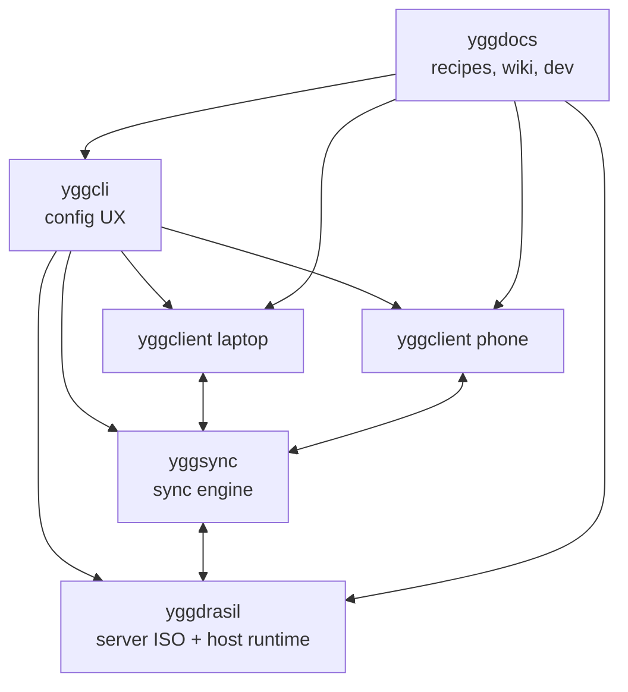

# yggcli

`yggcli` is the calm front door into the Yggdrasil ecosystem.

It exists for the moment when a user wants the power of `yggdrasil`, `yggclient`, and `yggsync`, but not the friction of remembering every knob, file path, and prerequisite on day one.
It does not hide the system behind a private state database.
It writes the real config files the ecosystem already uses, so the path from beginner to operator stays open.

That is the point of `yggcli`:

- make the first run feel guided instead of hostile
- make the second run feel familiar instead of mysterious
- keep the generated files plain, inspectable, and editable
- stay optional for seasoned users who prefer to drive the repos directly

## The Ecosystem At A Glance

A simple mental model helps:

- a `yggdrasil` server is the host you boot from the ISO
- a `yggclient` machine is a laptop, desktop, or phone that talks to that host
- `yggsync` moves the files you care about without turning your devices into a furnace
- `yggcli` is the guide that writes the right config files for all of them

```text
                    +----------------------+
                    |       yggdocs        |
                    | recipes, wiki, dev   |
                    +----------+-----------+
                               |
                               v
 +------------+      +---------+---------+      +-------------+
 | yggclient  |<---->|      yggsync      |<---->| yggclient   |
 | laptop     |      | sync engine/jobs  |      | phone       |
 +------+-----+      +---------+---------+      +------+------+
        \                        |                       /
         \                       |                      /
          \                      v                     /
           +-----------------------------------------+
           |               yggdrasil                 |
           | Debian sid ISO, ZFS, LXC, host runtime  |
           +-------------------+---------------------+
                               ^
                               |
                        +------+------+
                        |   yggcli    |
                        | config UX   |
                        +-------------+
```

Mermaid version:



## Why It Exists

Yggdrasil is powerful, but the ecosystem is broader than a single ISO build script.
A real user eventually touches:

- server build profiles
- SSH key embedding
- host networking choices
- client bootstrap
- sync job definitions

For a new operator, that can feel like a cliff.
`yggcli` turns it into a staircase.

It gives you:

- an interactive terminal UI for guided configuration
- a non-interactive mode for automation and agent orchestration
- platform-aware behavior across Linux and Android/Termux
- sensible defaults that can later be replaced with exact values

## Quick Start

If you want the fastest path:

```bash
npx -y yggcli --help
```

If you prefer a direct installer:

```bash
curl -fsSL https://raw.githubusercontent.com/yggdrasilhq/yggcli/main/install.sh | bash
yggcli --help
```

For local development:

```bash
cargo run
```

If you are unsure where to start, use this sequence:

1. bootstrap the workspace
2. write defaults
3. inspect the generated files
4. build the server ISO
5. come back later and tune the dials with intent

Example:

```bash
yggcli --bootstrap --write-defaults
yggcli --workspace ~/gh --build-iso --profile server
```

## What It Writes

`yggcli` writes the native config files already used by the ecosystem:

- `yggdrasil/ygg.local.toml`
- `yggclient/yggclient.local.toml`
- `yggclient/config/profiles.local.env`
- `yggsync/ygg_sync.local.toml`

That means:

- power users can keep editing the files by hand
- automation can diff and version them normally
- reruns feel like continuing work, not starting over

## What A Server Is

A Yggdrasil server is not just “a Debian ISO.”
It is the host foundation for the rest of the ecosystem:

- bootable from USB
- ZFS-aware
- LXC-oriented
- shaped to become the machine that holds the rest of your stack together

For many users, this is the machine that will eventually run:

- storage
- containers
- sync targets
- backups
- service front doors

`yggcli` helps you get that first server config into a sane state before you ask more of it.

## What A Client Is

A Yggdrasil client is the machine you actually touch every day:

- a Debian laptop
- a workhorse desktop
- a phone running Termux

The client side matters because that is where people feel the system.
If sync is noisy, if setup is confusing, or if every machine needs hand-carved scripts, the ecosystem loses its warmth.

That is why `yggcli` writes both:

- `yggclient.local.toml`
- `config/profiles.local.env`

The modern config and the compatibility layer move together.

## First-Time Experience

For a first Yggdrasil server, the recommended path is conservative:

1. keep `apt_proxy_mode=off`
2. build and boot the host
3. validate the host and container baseline
4. create the apt-proxy LXC from the docs recipe
5. switch later builds to `apt_proxy_mode=explicit`

This is deliberate.
The first success should be understandable.
Speed comes after trust.

## Guided Examples

### 1. First server, minimum decisions

```bash
yggcli --bootstrap --write-defaults
yggcli --workspace ~/gh --build-iso --profile server
```

Use this when:

- you want the baseline first
- you are still learning the shape of the ecosystem
- you do not yet want to decide every network and proxy detail

### 2. Build a server with explicit overrides

```bash
yggcli --workspace ~/gh \
  --set yggdrasil.hostname=mewmew \
  --set yggdrasil.net_mode=dhcp \
  --set yggdrasil.macvlan_cidr=10.10.0.250/24 \
  --set yggdrasil.macvlan_route=10.10.0.0/24 \
  --build-iso --profile server
```

Use this when:

- you know your host naming already
- you want automation without opening the TUI
- an agent or CI job is driving the build

### 3. Configure client + sync without building an ISO

```bash
yggcli --workspace ~/gh \
  --set yggclient.profile_name=laptop \
  --set yggclient.user_name=alice \
  --set yggclient.ssh_host=example-host \
  --set yggsync.notes_local=~/Documents/notes \
  --set yggsync.notes_remote=nas:users/alice/notes \
  --write-defaults --force
```

Use this when:

- the server already exists
- you are onboarding a second machine
- you want the ecosystem config, not a host rebuild

## Non-Interactive Use

`yggcli` is not only a TUI.
It can be used as an orchestration tool in CI, scripts, and agent workflows.

Examples:

```bash
yggcli --bootstrap --write-defaults
yggcli --workspace ~/gh --build-iso --profile server
yggcli --workspace ~/gh --smoke --profile kde --with-qemu
yggcli --workspace ~/gh \
  --set yggdrasil.hostname=mewmew \
  --set yggdrasil.net_mode=dhcp \
  --set yggdrasil.macvlan_cidr=10.10.0.250/24 \
  --set yggdrasil.macvlan_route=10.10.0.0/24 \
  --build-iso --profile server
```

Notes:

- repeat `--set` to override exact fields without editing files by hand
- ISO builds automatically use `sudo -n` when root privileges are required
- Android/Termux hosts are blocked from server ISO build actions by design

The non-interactive mode is there for disciplined work:

- repeatability
- agent automation
- CI or release benches
- exact overrides without a one-off fork of the config files

## Interactive Controls

- `Tab` / `Shift-Tab`: switch section
- `Up` / `Down`: move between fields
- `Enter`: toggle boolean fields
- `Ctrl-S`: save generated config files
- `q`: quit
- mouse: click tabs, click fields, scroll within sections

## Platform Behavior

- Linux hosts can bootstrap the full workspace and run `yggdrasil` build and smoke actions.
- Android/Termux hosts bootstrap `yggcli`, `yggclient`, `yggsync`, and `yggdocs`.
- Android/Termux hosts do not run `yggdrasil` ISO builds or smoke benches.
- Existing local config files are loaded first, so reruns behave like editing a live workspace.

## For Experienced Users

You do not have to use `yggcli`.

If you already know the ecosystem well, you can continue to:

- edit `ygg.local.toml` directly
- run `mkconfig.sh` yourself
- maintain `yggclient` and `yggsync` configs by hand

`yggcli` is not here to trap you.
It is here to lower friction, reduce mistakes, and make the common path obvious.

If you already have a working mental model, use `yggcli` like a sharp utility:

- generate a starting config
- inspect the diff
- keep what helps
- ignore the rest

## Stack

- Rust
- ratatui
- crossterm

## License

Apache-2.0
