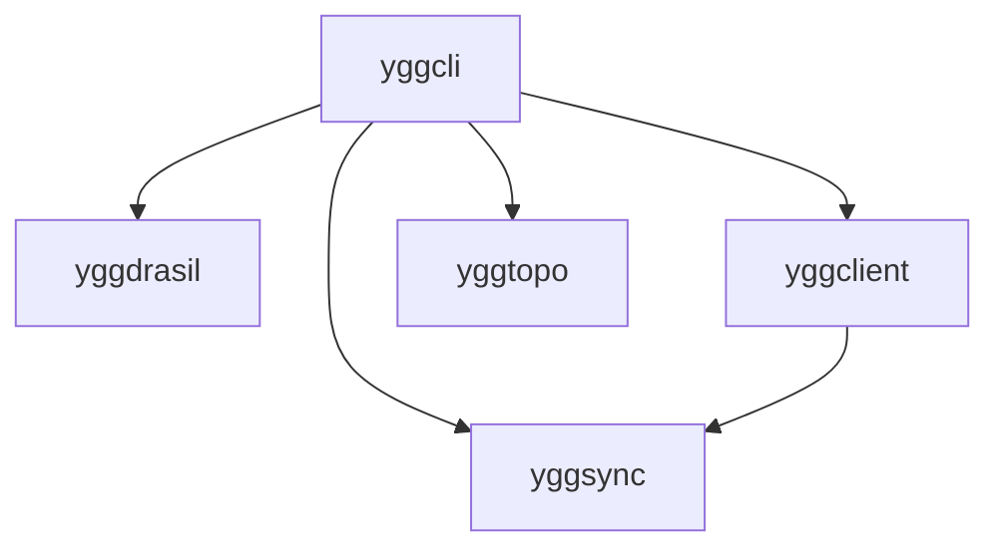
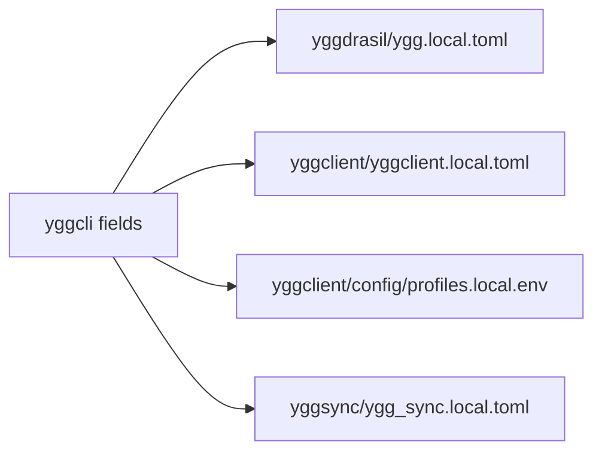

# yggcli

`yggcli` is the guided front door into the Yggdrasil ecosystem.

It does not create a hidden control plane.
It writes the real config files the other repos already use, so the path from first-run user to confident operator stays open.

This README is the operator manual for using `yggcli` as the bootstrap layer for `yggdrasil`, `yggclient`, and `yggsync`.

## Overview

Use `yggcli` when you want guided setup, sane defaults, and inspectable output files.

It is responsible for:

- bootstrapping a workspace with the right repos
- collecting config values through a TUI or CLI flags
- writing native config files into those repos
- optionally kicking off a server ISO build on Linux



## Concepts

### Guide, Not Control Plane

`yggcli` is meant to disappear after it has done its job.

It writes plain files so you can:

- inspect the generated output
- edit it by hand later
- version it normally
- rerun `yggcli` without feeling trapped by it

### One Workspace, Real Repos

On Linux, bootstrap keeps the ecosystem together in one workspace, including:

- `yggdrasil`
- `yggclient`
- `yggsync`
- `yggdocs`
- `yggterm`
- `yggtopo`

On Android or Termux, the bootstrap is smaller and does not pull in server-build work.

### Current Promise

Today `yggcli` can:

- launch an interactive TUI
- bootstrap missing repos
- write local config defaults
- apply exact overrides with `--set`
- run Linux ISO build and smoke flows

It should be thought of as a guided writer for ecosystem config, not as an all-purpose runtime manager.

## What It Writes

`yggcli` writes the native files already used by the other repos:

- `yggdrasil/ygg.local.toml`
- `yggclient/yggclient.local.toml`
- `yggclient/config/profiles.local.env`
- `yggsync/ygg_sync.local.toml`

That split matters:

- `yggdrasil` gets host-build settings
- `yggclient` gets endpoint profile settings
- `yggsync` gets sync-engine defaults



## First Run

### Linux Server

The conservative first server path is still the right one.

1. bootstrap the workspace
2. write defaults
3. inspect the generated files
4. build the server ISO
5. tune advanced options only after the first host is alive

```bash
curl -fsSL https://raw.githubusercontent.com/yggdrasilhq/yggcli/main/install.sh | bash
yggcli --bootstrap --write-defaults
yggcli --workspace ~/gh --build-iso --profile server
```

First server guidance:

- keep `apt_proxy_mode=off`
- keep `infisical_boot_mode=disabled` unless you already run Infisical in an LXC
- keep `with_lts=false` unless you intentionally want the compatibility-pinned kernel path

Later, after the host is alive:

- switch to `apt_proxy_mode=explicit` if you adopt the apt-proxy container pattern
- switch to `infisical_boot_mode=container` only if you intentionally adopt that pattern

### Client And Sync Bootstrap

Use this when the server already exists and you want endpoint defaults written cleanly.

```bash
yggcli --workspace ~/gh \
  --set yggclient.profile_name=laptop \
  --set yggclient.user_name=alice \
  --set yggclient.ssh_host=nas-box \
  --set yggsync.notes_local=~/Documents/notes \
  --set yggsync.notes_remote=nas:users/alice/notes \
  --write-defaults --force
```

This is the mode most relevant to `yggclient` and `yggsync` onboarding.

### Android Or Termux

Android or Termux hosts can bootstrap the client-side stack, but they do not build `yggdrasil` ISOs.

```bash
curl -fsSL https://raw.githubusercontent.com/yggdrasilhq/yggcli/main/install.sh | bash
yggcli --bootstrap --write-defaults
```

Use this when:

- you want `yggclient` and `yggsync` defaults on the phone
- you want the safe path first
- you do not want Android attempting server-build work

## Normal Operation

### TUI

Running `yggcli` with no arguments launches the interactive TUI.

Use it when:

- you want guided field-by-field editing
- you are still learning the ecosystem
- you want to save config without memorizing file paths

Controls:

- `Tab` / `Shift-Tab`: switch section
- `Up` / `Down`: move between fields
- `Enter`: toggle booleans
- `Ctrl-S`: save generated files
- `q`: quit
- mouse: click tabs, click fields, scroll sections

### Non-Interactive CLI

Use the CLI mode when you need repeatability, exact overrides, or agent-friendly automation.

Examples:

```bash
yggcli --bootstrap --write-defaults
yggcli --workspace ~/gh --build-iso --profile server
yggcli --workspace ~/gh --smoke --profile kde --with-qemu
yggcli --workspace ~/gh \
  --set yggdrasil.hostname=mewmew \
  --set yggdrasil.net_mode=dhcp \
  --set yggdrasil.with_lts=false \
  --build-iso --profile server
```

Notes:

- repeat `--set` to override exact fields without hand-editing files first
- Linux ISO builds automatically use `sudo -n` when root privileges are required
- Linux bootstrap also clones `yggtopo`
- Android or Termux hosts are blocked from server ISO build actions by design

## Bootstrap Patterns Worth Automating

This is the section that should influence the future TUI design.

The most useful end-user patterns look like this:

### 1. First Server, Minimum Risk

The TUI should make the conservative first-host path obvious:

- apt proxy off
- Infisical boot disabled
- normal sid kernel path
- build first, optimize later

### 2. Laptop With Mounted NAS

The TUI should be able to ask:

- is this endpoint using direct SMB credentials or a mounted NAS path
- should the generated desktop service enforce a mount-point guard
- which small jobs should be enabled first

### 3. Android With Guarded Sync

The TUI should be able to ask:

- which Termux-accessible folders matter first
- whether Wi-Fi-only should be required
- what battery and temperature limits should gate jobs
- whether Tailscale-dependent NAS access needs defer behavior

### 4. Obsidian Worktree Bootstrap

The TUI should be able to ask:

- where the local vault lives
- where the central repository lives
- whether the first operation should be `update` or `commit`
- which default filters to apply for `.obsidian`, trash, conflict files, and DOS aliases

Those patterns are not just documentation ideas.
They are the most likely high-value prompts to wire into `yggcli` next.

## Platform Behavior

- Linux can bootstrap the full workspace and run `yggdrasil` build and smoke actions
- Android or Termux bootstraps `yggcli`, `yggclient`, `yggsync`, and `yggdocs`
- Android or Termux does not run `yggdrasil` ISO builds or smoke benches
- existing local config files are loaded first, so reruns behave like editing a live workspace

## Troubleshooting

### The generated files look wrong

That usually means either:

- the wrong workspace was selected
- `--set` overrides targeted the wrong section or key
- existing local config files were loaded and are influencing what you see

Inspect the generated files directly. That is the intended workflow.

### Android is trying to behave like a server host

That should not happen.
Android or Termux is intentionally blocked from server ISO build actions.

### I only want the files, not the build

Use:

```bash
yggcli --bootstrap --write-defaults
```

and stop there.

### I already know the ecosystem and do not want a wizard

That is fine. Use `yggcli` as a sharp utility:

- generate a starting config
- inspect the diff
- keep what helps
- ignore the rest

## Release And Development

Install from the release installer:

```bash
curl -fsSL https://raw.githubusercontent.com/yggdrasilhq/yggcli/main/install.sh | bash
```

Run locally during development:

```bash
cargo run
```

Stack:

- Rust
- ratatui
- crossterm
- GitHub Actions for release automation

## License

Apache-2.0
